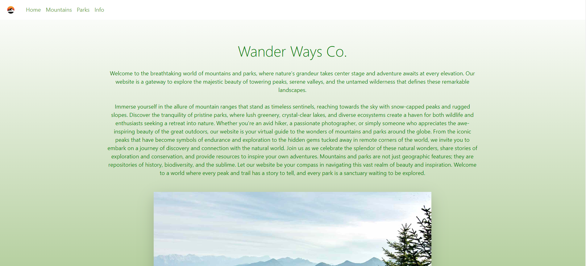

# Capstone 2: Enjoy the outdoors

Description:
HTML, CSS and JS project

Welcome to Wander Ways Co., your ultimate destination for exploring the majestic beauty of mountains and parks around the world! Immerse yourself in the wonders of nature as you embark on a journey to discover valuable information about mountains and parks tailored to your preferences.

Mountain Explorer:
Unleash the adventurer in you by accessing a wealth of information on mountains from every corner of the globe. Whether you're an avid mountaineer, a casual hiker, or simply a nature enthusiast, Wander Ways Co. is your go-to resource for detailed mountain profiles, trail maps, elevation data, and captivating images. Navigate through our user-friendly interface to find the perfect mountain for your next expedition, and uncover hidden gems that will leave you in awe of the Earth's breathtaking landscapes.

Park Discovery:
Embark on a quest to explore the world's most enchanting parks with our comprehensive Park Discovery feature. Search for parks based on location, allowing you to plan your next outdoor adventure with ease. Whether you're seeking a serene national park, a bustling urban oasis, or a coastal reserve, Wander Ways Co. has you covered. Refine your search by park types, from wildlife sanctuaries and botanical gardens to historical landmarks, ensuring that every outing aligns perfectly with your interests.

## Pages

### Home
This the landing page for my website Wander Ways Co which allows you to search for Mountain Info and Search for Parks by Location and Park Types!

National Park
)

Mountain info
)

### Interesting Code Snippet

This code was the most interesting to me because it was fun to work on and I feel like I was able to self-diagnose the errors I had and fix them on my own and it helped me understand arrays, loops, and objects even more. Plus, inner HTML is a life saver and this was probably the easiest code I had to read!

function displayParkCard (event) {
    const chosenLocation = event.target.value
    let html =""
    for (const currentPark of nationalParks) {
        if (currentPark.State === chosenLocation) {
            console.log("matching state:", currentPark)
            html += `
            

            

                
                <h4 class="card-header">${currentPark.LocationName}</h4>
                

                <li>Address: ${currentPark.Address}
                <li>City: ${currentPark.City}
                <li>State: ${currentPark.State}
                 <li>Zip Code: ${currentPark.ZipCode} 
                 <li>Phone Number: ${currentPark.Phone}
                 <li>Fax Number: ${currentPark.Fax}
                 <li>Coordinates: ${currentPark.Location.coordinates}
                 <li>Type: ${currentPark.Location.type}
                 <li><a href="${currentPark.Visit}">Visit Park</a>
                

                

            
 
            `
        }
    }
    const resultsElement = document.getElementById("matching-parks")
    resultsElement.innerHTML = html
}
